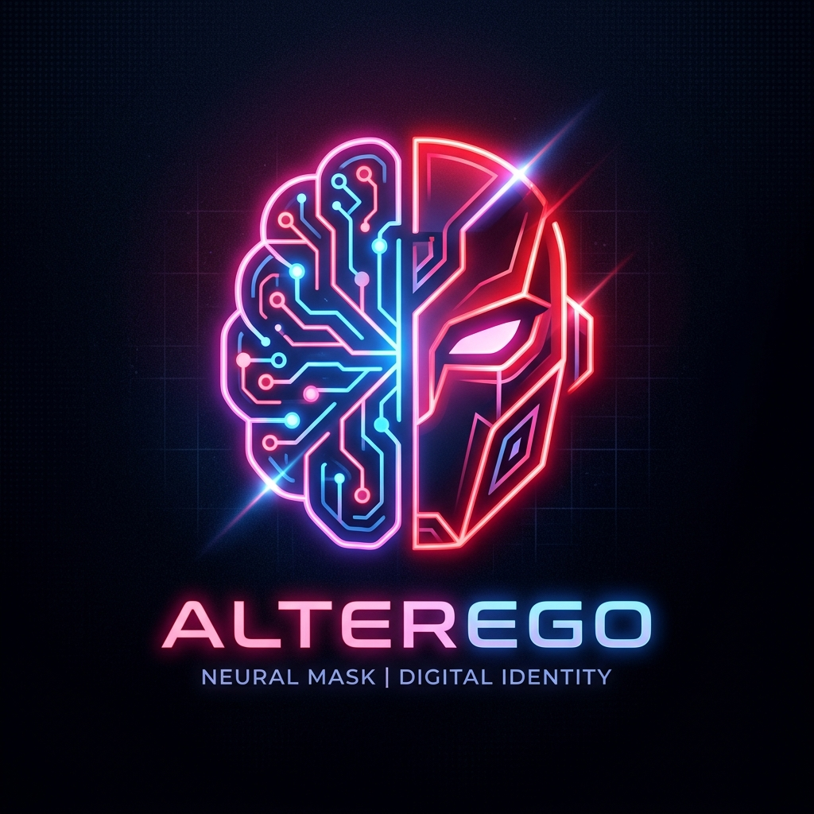
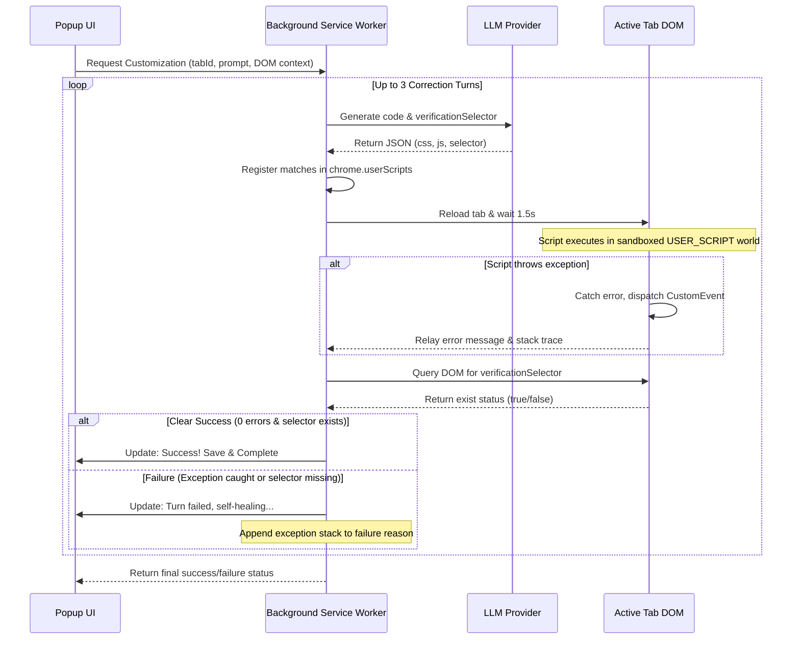

# AlterEgo

  

AlterEgo is a premium Manifest V3 Chrome Extension that uses AI (OpenAI-compatible protocol) to dynamically rewrite and customize webpage styles and behaviors. It provides a visual target picker, supports multiple parallel modifications per website, and implements a multi-turn **Agentic Self-Healing Loop** to automatically test, catch, and self-correct script errors.

---

## Key Features

1. **OpenAI-Compatible Model Integration:** Connect to any API provider (OpenAI, DeepSeek, OpenRouter, Groq, Google Gemini, or Local Ollama/LM Studio) by supplying a Base URL and API Key. The extension automatically fetches and selects from available model lists.
2. **Visual Target Selector:** Inspect and point-and-click to extract CSS selector paths on active tabs to target elements precisely with AI.
3. **Flicker-Free Injections:** Registers code at `document_start` to inject styled CSS immediately (preventing layout flash/FOUC), wrapping functional JS to run as soon as `DOMContentLoaded` is ready.
4. **Multi-Customization Manager:** Run multiple parallel modifications per domain. Enable, disable, or delete them individually from the side panel.
5. **Interactive AI Refinements:** Select any active modification, type your adjustments, and the AI will selectively update and merge refinements into that specific script, leaving others intact.

---

## 🛠️ The Agentic Self-Healing Loop

The hallmark feature of AlterEgo is its **multi-turn self-correction mechanism**. When AlterEgo generates a customization script, it verifies execution inside the active tab before finalizing the registration.

### 1. Cross-World Error Bridge
Because user scripts run in a sandboxed `USER_SCRIPT` execution world, they do not have access to standard extension APIs like `chrome.runtime.sendMessage`.
AlterEgo wraps all user script executions in a `try/catch` block. If an error is caught, the wrapper dispatches a custom `alterego-script-error` event to the `window`. The extension's isolated content script listens for this event and relays the error metadata (message and call stack) to the background worker.

### 2. DOM Verification
When compiling the script, the AI model generates an optional `verificationSelector` (e.g., the selector of a new badge, button, or container it expects to create or modify). After the tab reloads, AlterEgo query-selects this selector to verify that the visual change was successfully rendered.

### 3. LLM Self-Correction
If verification fails (due to a JS runtime exception or missing DOM element):
*   AlterEgo automatically formats the failure details (the complete error log, exception name, stack trace, and DOM context).
*   It sends a retry prompt back to the AI model.
*   The AI analyses the failure reason (e.g., detecting a null reference, an incorrect CSS selector, or an infinite loop) and generates a corrected script.
*   AlterEgo registers the corrected script and retries verification for up to 3 turns.

### 4. Live UI Progress Logs
The side panel loader updates in real-time as the background worker runs through the self-healing attempts:
*   *Attempt 1/3: Querying AI model...*
*   *Attempt 1/3: Code generated. Injecting and reloading tab...*
*   *⚠️ Attempt 1 failed with JS runtime error. Self-healing...*
*   *Attempt 2/3: Querying AI model...*
*   *✓ Customization verified successfully!*

---

## Project Structure
*   `manifest.json` — Extension configuration, declaring permissions and matching content scripts.
*   `background.js` — Service worker managing the self-healing loop and sync routines.
*   `prompts.js` — Storage for modular LLM system and user prompt templates.
*   `content/context-extractor.js` — Content script for DOM layout indexing, visual picking, and error bridging.
*   `popup/` — side panel controller scripts and glassmorphism interface styling.
